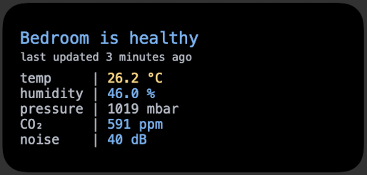

# Scriptable script for Netatmo Home Coach

## What's this?

A script meant to be run with [Scriptable](https://docs.scriptable.app/) on an iOS device to display information from a Netatmo Home Coach.

## What you should know

Netatmo has an official iOS app that provides access to pretty much the same information, as well as a dashboard for historical data + trends, and an admin panel. Sadly, it currently does not have a homescreen widget, and 99% of the time I open the app for the sole purpose of checking the current information. This saves me a few clicks and is mostly an excuse to try out Scriptable :)

## How do I use this?

1. Create a new app in the [Netatmo developer portal](https://dev.netatmo.com/apps/createanapp), noting down your app's client ID and client secret.
2. Clone this repo and install dependencies with `yarn`.
3. Copy `config.template.json` and rename to `config.json` in the same directory. Replace the empty strings with your own config values.
4. Run `yarn compile` to generate the `netatmo.js` script.
5. Follow insturctions from the Scriptable app to add the script. For best results, please run it from a medium-sized widget.
